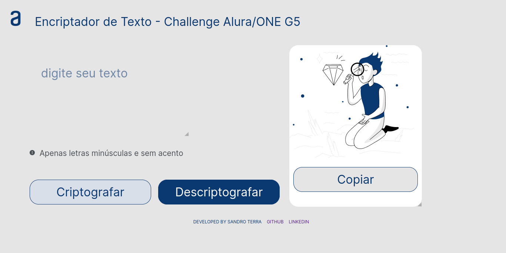

<h1>ONE - Alura Challenge 05</h1>

<h1>Decodificador - text_decoder</h1>

Projeto realizado para atender o desafio proposto no curso Alura Latam ONE (Oracle Next Education).

<h2>Requisitos:</h2>

<li>Criptografar mensagens utilizando um algoritmo sugerido nos requisitos do projeto.</li>
<li>Descriptografar mensagens previamente criptografadas.</li>
<li>Copiar mensagens criptografadas ou descriptografadas para a área de transferência.</li>

<h2>Tecnologias utilizadas</h2>

O projeto foi desenvolvido utilizando as seguintes tecnologias:

<h2>Uso</h2>

Para utilizar o decodificador, acesse-o através do seguinte <a href="https://sandro-terra.github.io/text_decoder/">link</a> ou nesse outro <a href="https://textdecoderalura.netlify.app/">aqui</a>.

